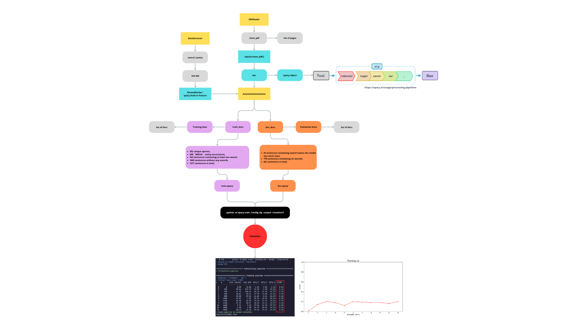
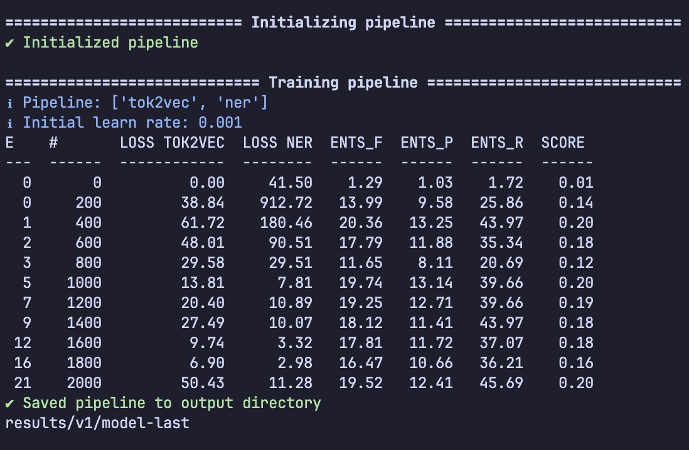
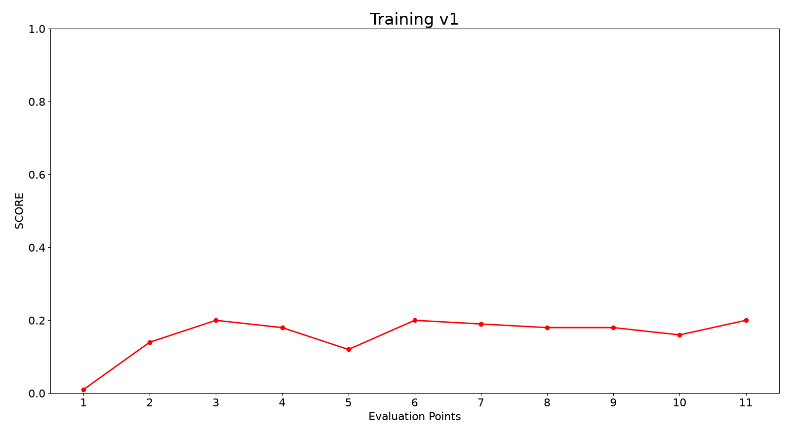

# Project We(are)evil
## Named Entity Recognition for identifying taxonomic names of weevils in text using spaCy

In this project, I'm training a NER model using spaCy to identify taxonomic names of weevils in text.
### Why this project?
After completing the [ADVANCED NLP with spaCy](https://course.spacy.io/en/) course, I wanted to try to train my own little NER model. Why weevils? Because I love them (who doesn't?).

## Version 1
This is the first version of the model.
### 1. Structure and process

Using the PhraseMatcher from spaCy, I was able to automate the labeling process as "WEEVIL" entities. I used this method for both training and evaluation data.

### 2. Data

I split the data at the name level to make sure that no name used for evaluation was seen during training:
- Every name seen by the model was written to a separate `.txt` file.
- Every remaining name was written to another `.txt` file, which was used for evaluation.

The datasets used for training and evaluation are not included in this repository. Please refer to the sources listed in "Credits" to obtain the original data.

#### 2.1. Training data

To train the model, I used the Electronic Catalogue of Weevil names (Curculionoidea) from the [World Information Network on Weevils](https://wtaxa.csic.es/), which contains 103,660 taxonomic names across multiple taxonomic ranks. The data was downloaded from [GBIF](https://www.gbif.org/fr).

The training data comes from Thompson, R. T. (1992). Observations on the morphology and classification of weevils (Coleoptera, Curculionoidea) with a key to major groups. Journal of Natural History, 26(4), 835-891.
This text contains:
- 252 unique species,
- 608 `WEEVIL` entity occurrences,
- 362 sentences containing at least one weevil,
- 1009 sentences without any weevils,
- 1371 sentences in total.

#### 2.2. Evaluation data
The evaluation data comes from Oberprieler, R. O. L. F., Marvaldi, A., & Anderson, R. S. (2007). Weevils, weevils, weevils everywhere.
It contains:
- 83 sentences containing weevil names the model has never seen,
- 778 sentences containing no weevils,
- 861 sentences in total.

### 3. Results

Well, it turns out everything did not go as planned.

The model is evaluated using spaCy's NER metrics. The training output reports LOSS TOK2VEC, LOSS NER, ENTS_F, ENTS_P, ENTS_R and SCORE.
The best SCORE reached was 0.20, which is not as good as I wanted.

The table below shows the metrics reported by spaCy throughout the training process.

### 4. What's next?
For the next version, I will only modify the evaluation data. That way, I can isolate the impact of the evaluation data on the measured performance. 

## Credits
### Data sources:
[World Information Network on Weevils](https://wtaxa.csic.es/).

[Global Biodiversity Information Facility](https://www.gbif.org/fr).

### References:
Thompson, R. T. (1992). Observations on the morphology and classification of weevils (Coleoptera, Curculionoidea) with a key to major groups. Journal of Natural History, 26(4), 835-891.

Oberprieler, R. O. L. F., Marvaldi, A., & Anderson, R. S. (2007). Weevils, weevils, weevils everywhere.

### Tools:
[Python](https://www.python.org/)

[spaCy](https://spacy.io/)

### Special thanks:
RECULET Marius, for the inspiring name and valued guidance and support.